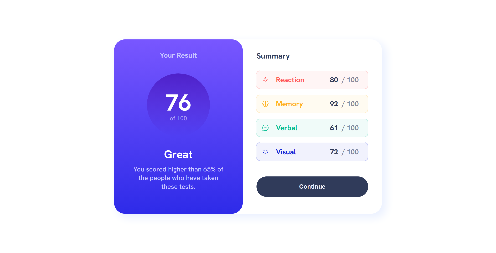
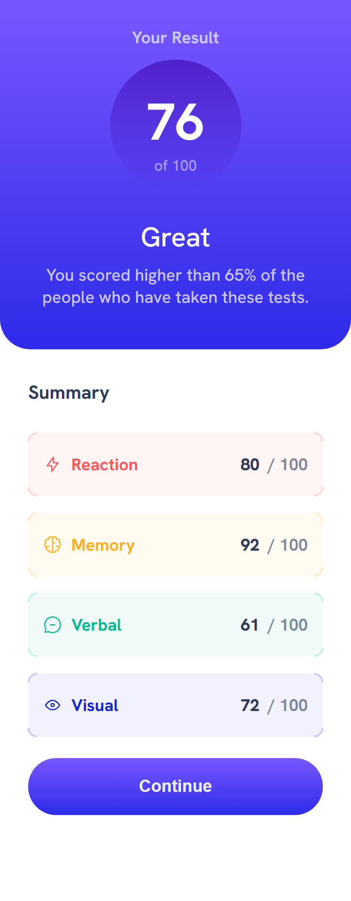

# Frontend Mentor - Results summary component solution

This is a solution to the [Results summary component challenge on Frontend Mentor](https://www.frontendmentor.io/challenges/results-summary-component-CE_K6s0maV). Frontend Mentor challenges help you improve your coding skills by building realistic projects.

## Table of contents

- [Overview](#overview)
  - [The challenge](#the-challenge)
  - [Screenshot](#screenshot)
  - [Links](#links)
- [My process](#my-process)
  - [Built with](#built-with)
  - [What I learned](#what-i-learned)
  - [Continued development](#continued-development)
- [Author](#author)

## Overview

### The challenge

Users should be able to:

- View the optimal layout for the interface depending on their device's screen size
- See hover and focus states for all interactive elements on the page

### Screenshot

**Result Summary Component: Snapshot of desktop screen at 1440px**

**Result Summary Component: Snapshot of mobile screen at 375px**

### Links

- Solution URL: [Source Code](https://github.com/SoniBasant/Frontend-Mentor-Projects/tree/main/A2-Result-Summary-Component)

- Live Site URL: [Live Link](https://sonibasant.github.io/Frontend-Mentor-Projects/A2-Result-Summary-Component/resultSummary.html)

## My process

### Built with

- Semantic HTML5 markup
- CSS custom properties
- Flexbox
- Mobile-first workflow

### Continued development

We can use _data.json_ file for icons, categories and score. By using this file, we can add the results and total score dynamically if we choose.

## Author

- GitHub - [@SoniBasant](https://github.com/SoniBasant)
- Frontend Mentor - [@SoniBasant](https://www.frontendmentor.io/profile/SoniBasant)
- CodePen - [@SoniBasant](https://codepen.io/sonibasant)
- Hashnode - [@SoniBasant](https://sonibasant.hashnode.dev/)
