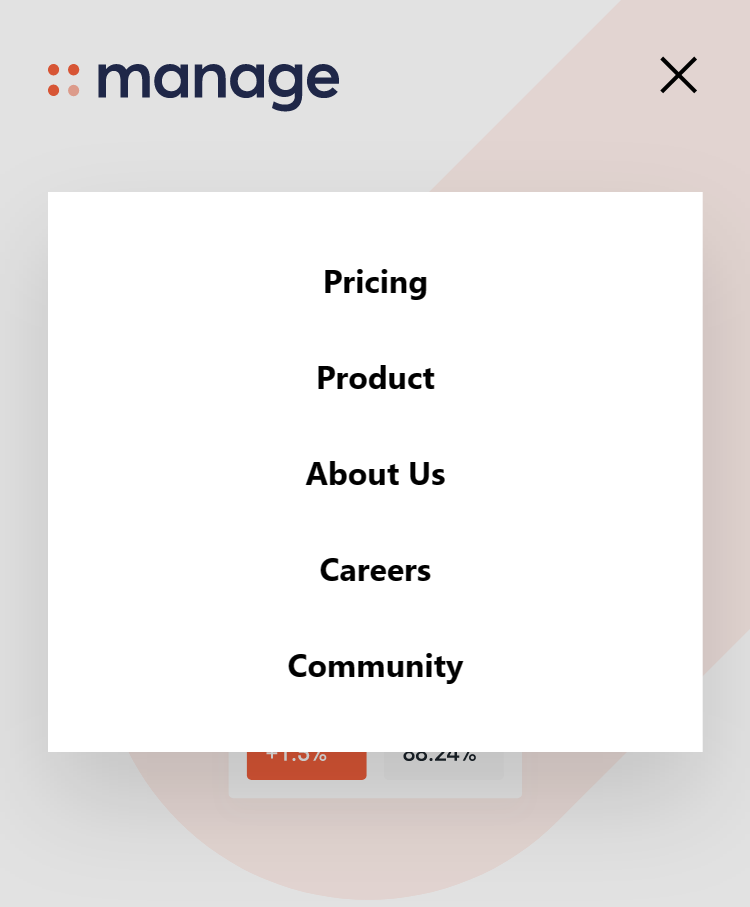

#  Frontend Mentor - Manage landing page solution

This is a solution to the [Manage landing page challenge on Frontend Mentor](https://www.frontendmentor.io/challenges/manage-landing-page-SLXqC6P5). Frontend Mentor challenges help you improve your coding skills by building realistic projects.

## Table of contents

- [Overview](#overview)
  - [The challenge](#the-challenge)
  - [Screenshot](#screenshot)
  - [Links](#links)
- [My process](#my-process)
  - [Built with](#built-with)
  - [What I learned](#what-i-learned)
  - [Continued development](#continued-development)
  - [Useful resources](#useful-resources)
- [Author](#author)
- [Acknowledgments](#acknowledgments)

## Overview

### The challenge

Users should be able to:

- View the optimal layout for the site depending on their device's screen size

- See hover states for all interactive elements on the page
- See all testimonials in a horizontal slider
- Receive an error message when the newsletter sign up `form` is submitted if:
  - The `input` field is empty
  - The email address is not formatted correctly

### Screenshot

**Desktop Design :**


**Mobile Design :**


**Navigation on Mobile Design :**



### Links

- Solution URL: [Source Code](https://github.com/SoniBasant/Frontend-Mentor-Projects/tree/main/A3-Manage-Landing-Page)

- Live Site URL: [Live Link](https://sonibasant.github.io/Frontend-Mentor-Projects/A3-Manage-Landing-Page/index.html)

## My process

### Built with

- Semantic HTML5 markup

- [Tailwind](https://tailwindcss.com/) - CSS Framework
- CSS custom properties
- Flexbox
- Desktop-first workflow

### What I learned

- Tailwind

  - Installation
  - Setup
  - Use of utility classes (lots of)

- Show / hide menu

- Use of SVG image as background
- Change colour of SVG image on hover

Below is the code for this >

```html
<a href="#">
  <svg ... ... ... class="text-white hover:text-brightRed">
    <path fill="currentColor" d="M20. ..." />
  </svg>
</a>
```

- Carousel with circle as progress indicator

- Email validation at Client Side

### Continued development

Need to give slider on desktop version for testimonials.

Your suggestions are welcome. 🙌

### Useful resources

- [Tailwind](https://tailwindcss.com/) - Tailwind Docs

- [Udemy](https://www.udemy.com/course/50-projects-50-days/) - Udemy course on DOM 📚

- [freecodecamp](https://www.freecodecamp.org/) - All the problems I solved. Helped me a lot. 🙌
- [w3schools](https://www.w3schools.com) - This helped me throughout my journey. Still doing. 🙂
- [Google API](https://fonts.googleapis.com/css?family=Open+Sans) - For fonts 🆎
- [cdnjs](https://cdnjs.cloudflare.com/ajax/libs/font-awesome/6.2.0/css/all.min.css) - For icons

## Author

Basant Soni 👨‍💻

- GitHub - [@SoniBasant](https://github.com/SoniBasant)

- Frontend Mentor - [@SoniBasant](https://www.frontendmentor.io/profile/SoniBasant)
- CodePen - [@SoniBasant](https://codepen.io/sonibasant)
- Hashnode - [@SoniBasant](https://sonibasant.hashnode.dev/)

## Acknowledgments

**Brad Traversy**

I wanted to start my **Tailwind** journey. But I was having trouble with it. And luckily I found Brad's video on youtube. It helped me to setup Tailwind and I started learning from his video.

He made video on the same project, but did not give exact style project demanded. And that's a really good thing about his video. He didn't to teach you how to walk, he teach you how to keep your first steps. Rest is on you.

[Link of youtube video](https://www.youtube.com/watch?v=dFgzHOX84xQ&list=PLCGhSm4oeC6aWW7lOe4u22O3bMz9LKVbS)

- [GitHub Profile](https://github.com/bradtraversy)

- [Twitter Profile](https://twitter.com/traversymedia)


---

**Ecem Gokdogan**

I am learning a lot from Ecem's projects. Her consistency is inspiring.

I got to know about "author" and "keywords" tag which I am adding in all of my projects.

Same for profile count in GitHub, I add it after I saw it in her profile.

- [GitHub](https://github.com/ecemgo)

- [Frontend Mentor](https://www.frontendmentor.io/profile/ecemgo)


---

**Alex Marshall**

He helped me to change colour of SVG images on hover, for which he am grateful.

- [GitHub](https://github.com/AlexKMarshall)

Discord User Name : **AlexKMarshall#8139**


