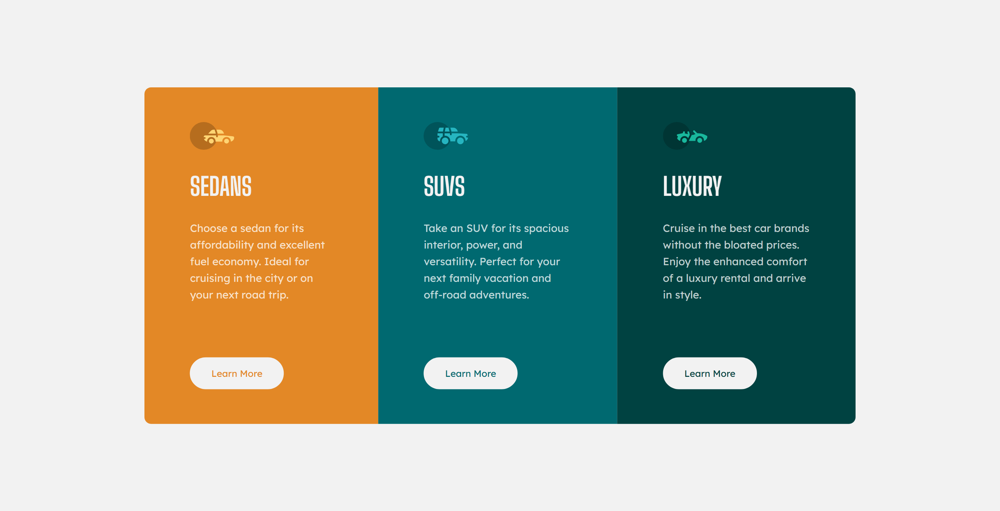

# Frontend Mentor - 3-column preview card component solution

This is a solution to the [3-column preview card component challenge on Frontend Mentor](https://www.frontendmentor.io/challenges/3column-preview-card-component-pH92eAR2-). Frontend Mentor challenges help you improve your coding skills by building realistic projects.

## Table of contents

- [Overview](#overview)
  - [The challenge](#the-challenge)
  - [Screenshot](#screenshot)
  - [Links](#links)
- [My process](#my-process)
  - [Built with](#built-with)
  - [What I learned](#what-i-learned)
- [Author](#author)

## Overview

### The challenge

Users should be able to:

- View the optimal layout depending on their device's screen size
- See hover states for interactive elements

### Screenshot

**Desktop Design :**

### Links

- Solution URL : [Source Code](https://github.com/SoniBasant/Frontend-Mentor-Projects/tree/main/A4-3-Column-preview-card-component-main)

- Live Site URL : [Live Link](https://sonibasant.github.io/Frontend-Mentor-Projects/A4-3-Column-preview-card-component-main/col-preview.html)

## My process

### Built with

- Semantic HTML5 markup

- CSS custom properties
- Flexbox
- Mobile-first workflow

### What I learned

This is my first webpage where I used "Mobile-first workflow".

## Author

- GitHub - [@SoniBasant](https://github.com/SoniBasant)
- Frontend Mentor - [@SoniBasant](https://www.frontendmentor.io/profile/SoniBasant)
- CodePen - [@SoniBasant](https://codepen.io/sonibasant)
- Hashnode - [@SoniBasant](https://sonibasant.hashnode.dev/)
