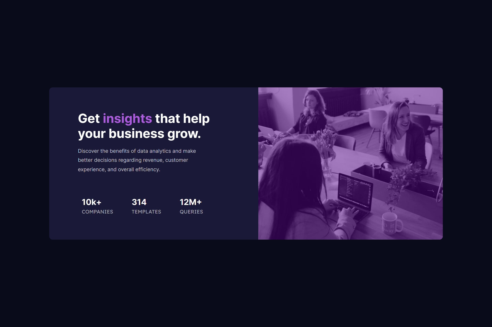

# Frontend Mentor - Stats preview card component solution

This is a solution to the [Stats preview card component challenge on Frontend Mentor](https://www.frontendmentor.io/challenges/stats-preview-card-component-8JqbgoU62). Frontend Mentor challenges help you improve your coding skills by building realistic projects.

## Table of contents

- [Overview](#overview)
  - [The challenge](#the-challenge)
  - [Screenshot](#screenshot)
  - [Links](#links)
- [My process](#my-process)
  - [Built with](#built-with)
  - [What I learned](#what-i-learned)
- [Author](#author)

## Overview

### The challenge

Users should be able to:

- View the optimal layout depending on their device's screen size

### Screenshot

**Stats Preview Card Component: Snapshot at Desktop view (1440px)**

### Links

- Solution URL: [Source Code](https://github.com/SoniBasant/Frontend-Mentor-Projects/tree/main/A7-Stats-Preview-Card-Component)

- Live Site URL: [Live Link](https://sonibasant.github.io/Frontend-Mentor-Projects/A7-Stats-Preview-Card-Component/statsPreview.html)

## My process

### Built with

- Semantic HTML5 markup

- CSS custom properties
- Flexbox
- CSS Grid
- Mobile-first workflow

**Concepts Used -**

- _picture_ tag

- _source_ tag
- _display: grid_ and _gap_ > to remove bottom paddings

### What I learned

- Make a translucent overlay over the image.

- Use _flex-direction: row-reverse_ to change the direction of the structure.

## Author

Basant Soni 👨‍💻

- GitHub - [@SoniBasant](https://github.com/SoniBasant)
- Frontend Mentor - [@SoniBasant](https://www.frontendmentor.io/profile/SoniBasant)
- CodePen - [@SoniBasant](https://codepen.io/sonibasant)
- Hashnode - [@SoniBasant](https://sonibasant.hashnode.dev/)
