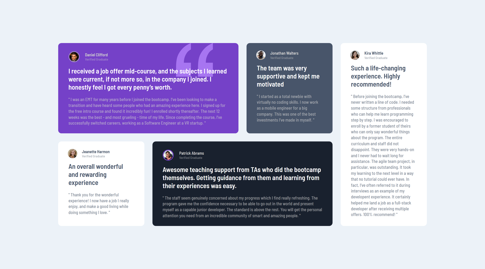

# Frontend Mentor - Testimonials grid section solution

This is a solution to the [Testimonials grid section challenge on Frontend Mentor](https://www.frontendmentor.io/challenges/testimonials-grid-section-Nnw6J7Un7). Frontend Mentor challenges help you improve your coding skills by building realistic projects.

## Table of contents

- [Overview](#overview)
  - [The challenge](#the-challenge)
  - [Screenshot](#screenshot)
  - [Links](#links)
- [My process](#my-process)
  - [Built with](#built-with)
  - [What I learned](#what-i-learned)
- [Author](#author)

## Overview

### The challenge

Users should be able to:

- View the optimal layout for the site depending on their device's screen size

### Screenshot

**Snapshot at desktop 1440px**

### Links

- Solution URL: [Source Code](https://github.com/SoniBasant/Frontend-Mentor-Projects/tree/main/B0-Testimonials-Grid-Section)

- Live Site URL: [Live Link](https://sonibasant.github.io/Frontend-Mentor-Projects/B0-Testimonials-Grid-Section/index.html)

## My process

This project is full of colours. Lots of colours. I have to be very careful to not miss any colour or its varient with opacity.

### Built with

- Semantic HTML5 markup

- CSS custom properties
- Flexbox
- CSS Grid
- Mobile-first workflow

### What I learned

Grid layout was good to learn. Its arrangement with different size for the component are the first time for me.

## Author

Basant Soni 👨‍💻

- GitHub - [@SoniBasant](https://github.com/SoniBasant)

- Frontend Mentor - [@SoniBasant](https://www.frontendmentor.io/profile/SoniBasant)
- CodePen - [@SoniBasant](https://codepen.io/sonibasant)
- Hashnode - [@SoniBasant](https://sonibasant.hashnode.dev/)
