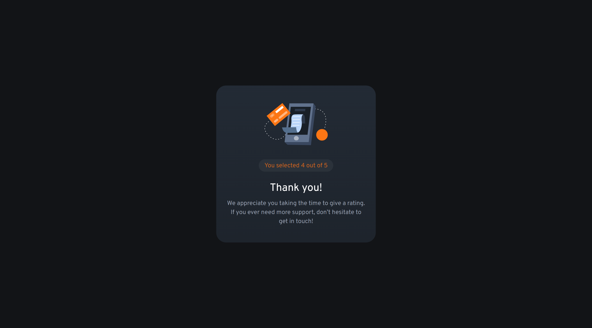

# Frontend Mentor - Interactive rating component solution

This is a solution to the [Interactive rating component challenge on Frontend Mentor](https://www.frontendmentor.io/challenges/interactive-rating-component-koxpeBUmI). Frontend Mentor challenges help you improve your coding skills by building realistic projects.

## Table of contents

- [Overview](#overview)
  - [The challenge](#the-challenge)
  - [Screenshot](#screenshot)
  - [Links](#links)
- [My process](#my-process)
  - [Built with](#built-with)
  - [Concepts Used](#concepts-used)
- [Author](#author)

## Overview

### The challenge

Users should be able to:

- View the optimal layout for the app depending on their device's screen size
- See hover states for all interactive elements on the page
- Select and submit a number rating
- See the "Thank you" card state after submitting a rating

### Screenshot

**Snapshot of `Rating card` at desktop width 1440px**


**Snapshot of `Thank you card` at desktop width 1440px**



### Links

- Solution URL: [Source Code](https://github.com/SoniBasant/Frontend-Mentor-Projects/tree/main/B2-Interactive-Rating-Component)

- Live Site URL: [Live Link](https://sonibasant.github.io/Frontend-Mentor-Projects/B2-Interactive-Rating-Component/index.html)

## My process

### Built with

- Vanilla JavaScript
- Semantic HTML5 markup
- CSS custom properties
- Flexbox
- Mobile-first workflow

### Concepts Used

- Use **data-value** to get rating value

```JS
const ratingGet = num.getAttribute('data-value');
```

- Use **session-storage** to store rating value temporary to show it in another page

```JS
sessionStorage.setItem('ratingGet', ratingGet);
```

Also to retrieve rating value

```JS
const ratingValue = sessionStorage.getItem('ratingGet');
```

- Use **window.location.href** to move at another page

```JS
window.location.href = 'index2.html';
```

- Use **template literals** to show selected rating

```JS
rating.innerHTML = `You selected ${ratingValue} out of 5`;
```

## Author

Basant Soni 👨‍💻

- GitHub - [@SoniBasant](https://github.com/SoniBasant)

- Frontend Mentor - [@SoniBasant](https://www.frontendmentor.io/profile/SoniBasant)
- CodePen - [@SoniBasant](https://codepen.io/sonibasant)
- Hashnode - [@SoniBasant](https://sonibasant.hashnode.dev/)
