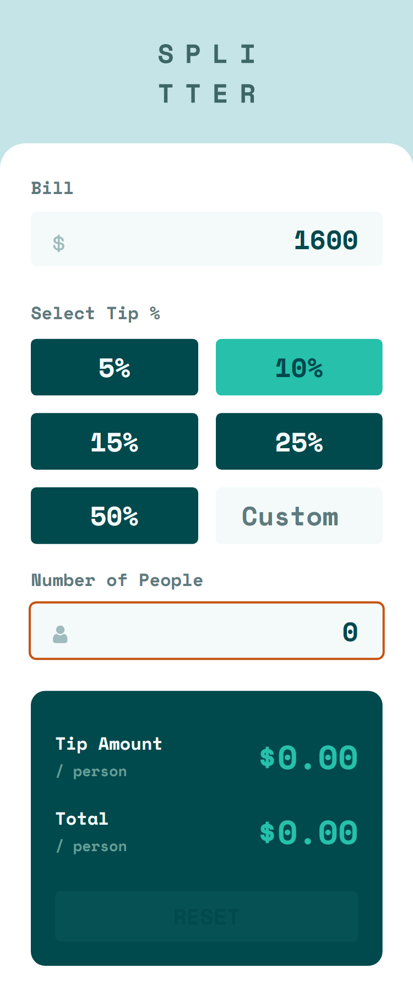

# Frontend Mentor - Tip calculator app solution

This is a solution to the [Tip calculator app challenge on Frontend Mentor](https://www.frontendmentor.io/challenges/tip-calculator-app-ugJNGbJUX). Frontend Mentor challenges help you improve your coding skills by building realistic projects.

## Table of contents

- [Overview](#overview)
  - [The challenge](#the-challenge)
  - [Screenshot](#screenshot)
  - [Links](#links)
- [My process](#my-process)
  - [Built with](#built-with)
  - [What I learned](#what-i-learned)
  - [Useful resources](#useful-resources)
- [Author](#author)

## Overview

### The challenge

Users should be able to:

- View the optimal layout for the app depending on their device's screen size
- See hover states for all interactive elements on the page
- Calculate the correct tip and total cost of the bill per person

### Screenshot

**Snapshot at desktop width 1440px > Person Zero**



**Snapshot at desktop width 1440px > With Input**


### Links

- Solution URL: [Source Code](https://github.com/SoniBasant/Frontend-Mentor-Projects/tree/main/B5-Tip-Calculator-App)

- Live Site URL: [Live Link](https://sonibasant.github.io/Frontend-Mentor-Projects/B5-Tip-Calculator-App/index.html)

## My process

### Built with

- Semantic HTML5 markup
- CSS custom properties
- Flexbox
- CSS Grid
- Mobile-first workflow

### What I learned

To remove up-down arrow button from input.
For Chrome, Safari, Edge, Opera

```css
.tip .custom::-webkit-outer-spin-button,
.tip .custom::-webkit-inner-spin-button {
  -webkit-appearance: none;
  margin: 0;
}
```

For Firefox

```css
.tip .custom[type='number'] {
  -moz-appearance: textfield;
  appearance: textfield;
}
```

### Useful resources

- [Google API](https://fonts.googleapis.com/css2?family=Space+Mono:wght@700&display=swap) - For font _Space Mono_

- [w3schools](https://w3schools.com) - To remove increment and decrement arrow in input

## Author

Basant Soni 👨‍💻

- GitHub - [@SoniBasant](https://github.com/SoniBasant)

- Frontend Mentor - [@SoniBasant](https://www.frontendmentor.io/profile/SoniBasant)
- CodePen - [@SoniBasant](https://codepen.io/sonibasant)
- Hashnode - [@SoniBasant](https://sonibasant.hashnode.dev/)
