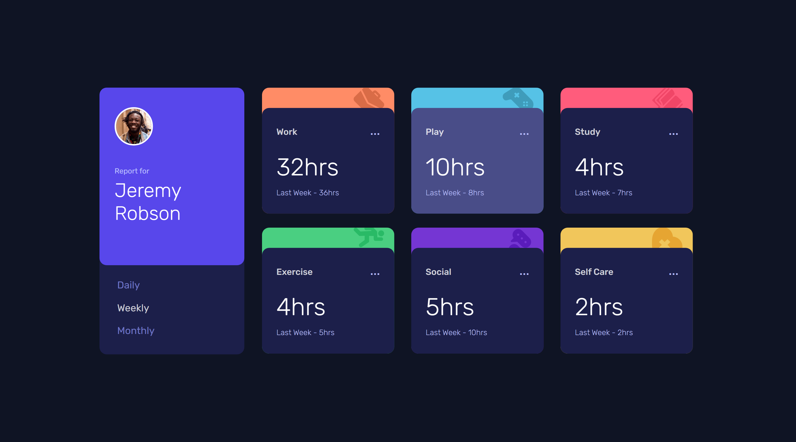
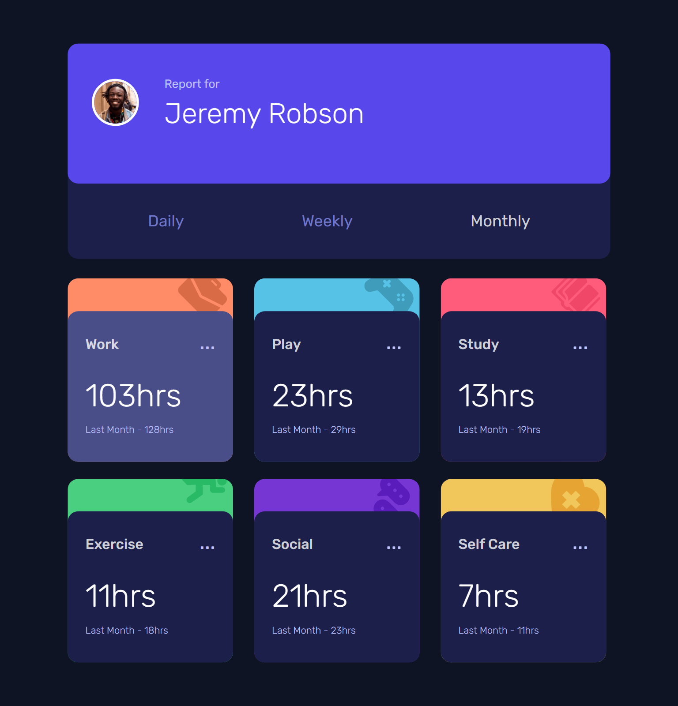

# Frontend Mentor - Time tracking dashboard solution

This is a solution to the [Time tracking dashboard challenge on Frontend Mentor](https://www.frontendmentor.io/challenges/time-tracking-dashboard-UIQ7167Jw). Frontend Mentor challenges help you improve your coding skills by building realistic projects.

## Table of contents

- [Overview](#overview)
  - [The challenge](#the-challenge)
  - [Expected behaviour](#expected-behaviour)
  - [Screenshot](#screenshot)
  - [Links](#links)
- [My process](#my-process)
  - [Built with](#built-with)
  - [What I learned](#what-i-learned)
  - [My Contribution](#my-contribution)
  - [Useful resources](#useful-resources)
- [Author](#author)

## Overview

### The challenge

Users should be able to:

- View the optimal layout for the site depending on their device's screen size
- See hover states for all interactive elements on the page
- Switch between viewing Daily, Weekly, and Monthly stats

This project is responsive at screens >

- Desktop XL > 2560px
- Laptop L > 1440px
- Laptop > 1024px
- Tablet > 768px
- Mobile L > 425px
- Mobile M > 375px
- Mobile S > 320px

### Expected behaviour

- The text for the previous period's time should change based on the active timeframe. For Daily, it should read "Yesterday" e.g "Yesterday - 2hrs". For Weekly, it should read "Last Week" e.g. "Last Week - 32hrs". For monthly, it should read "Last Month" e.g. "Last Month - 19hrs".

### Screenshot

**Snapshot at screen width 1440px >** Cursor on *Play* when *Weekly* data on screen (default)



**Snapshot at screen width 768px >** Cursor on *Work* when *Monthly* data selected



### Links

- Solution URL: [Source Code]()

- Live Site URL: [Live Link]()

## My process

### Built with

- Semantic HTML5 markup
- CSS custom properties
- Flexbox
- CSS Grid
- Mobile-first workflow
- JSON file

### What I learned

I could code three different functions for different time duration; i.e. `Weekly`, `Monthly` and `Daily`.

But with help of **function parameters** and **ternary operators**, I was able to make concise program.

Below is the **template literals** I used to add HTML code through JS >

```js
myDiv.innerHTML = `
  <div class="cards card${index + 1}">
    <div class="card-info">
      <div class="activity">
        <p>${el.title}</p>
        <a href="#">...</a>
      </div>

      <div class="hrs">
        <p>${el.timeframes[timeframe].current}hrs</p>
        <p>${
          timeframe === 'weekly'
            ? 'Last Week'
            : timeframe === 'monthly'
            ? 'Last Month'
            : 'Yesterday'
        } - ${el.timeframes[timeframe].previous}hrs</p>
      </div>
    </div>
  </div>
  `
```

### My Contribution

I made is responsive from **Mobile screen 320px** to **Desktop XL screen at 2560px**.

### Useful resources

- [Google Fonts](https://fonts.googleapis.com/css2?family=Rubik:wght@300;400;500&display=swap) - For Font Rubik 🆎

- [w3schools](https://www.w3schools.com) - This helped me throughout my journey. Still doing. 🙂

## Author

Basant Soni 👨‍💻

- GitHub - [@SoniBasant](https://github.com/SoniBasant)

- Frontend Mentor - [@SoniBasant](https://www.frontendmentor.io/profile/SoniBasant)
- CodePen - [@SoniBasant](https://codepen.io/sonibasant)
- Hashnode - [@SoniBasant](https://sonibasant.hashnode.dev/)
