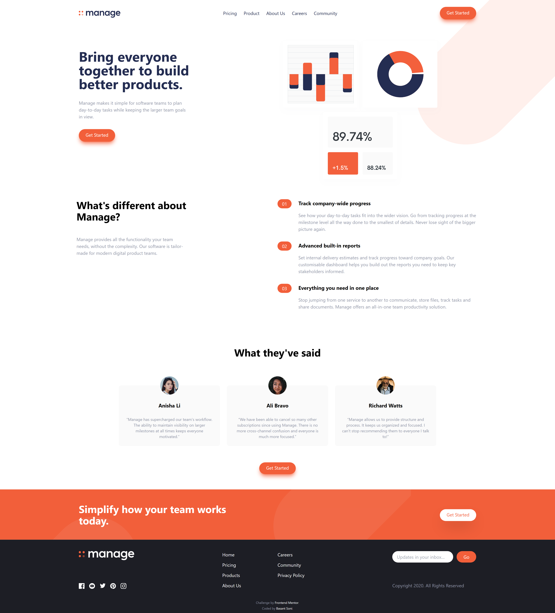

#  Frontend Mentor - Frontend Coding Challenges

This repository contain projects I am making on *www.frontendmentor.io*.

You can see my **frontend mentor** profile [here](https://www.frontendmentor.io/profile/SoniBasant).

**As I am not a PRO member in Frontend Mentor, I don't have access to any design files. So dimensions and sizes can be different. Be nice to me on that.**

## Table of contents

- [Overview](#overview)
  - [Snapshots](#snapshots)
  - [Links](#links)
- [My process](#my-process)
  - [Built with](#built-with)
  - [What I learned](#what-i-learned)
  - [Continued development](#continued-development)
  - [Useful resources](#useful-resources)
- [Author](#author)
- [Acknowledgments](#acknowledgments)

## Overview

**Improve your front-end coding skills by building real projects**

This is the tagline of **Frontend Mentor**. And rightly so. To learn, nothing is as good as making projects.

You will see all the projects I am making on this platform.

### Snapshots

Snapshots of the projects-

**QR Code :**

**Product Preview Card :**

**Manage Landing Page :**

### Links

| No. | Project Name                    | Source Code                                                                                                      | Live Link                                                                                                              |
| --: | ------------------------------- | ---------------------------------------------------------------------------------------------------------------- | ---------------------------------------------------------------------------------------------------------------------- |
| A0. | QR Code                         | [Code](https://github.com/SoniBasant/Frontend-Mentor-Projects/tree/main/A0.%20QR-code)                           | [Live](https://sonibasant.github.io/Frontend-Mentor-Projects/A0.%20QR-code/qrCode.html)                                |
| A1. | Product Preview Card            | [Code](https://github.com/SoniBasant/Frontend-Mentor-Projects/tree/main/A1.%20Product%20Preview%20Card)          | [Live](https://sonibasant.github.io/Frontend-Mentor-Projects/A1.%20Product%20Preview%20Card/productPreCard.html)       |
| A2. | Result Summary Component        | [Code](https://github.com/SoniBasant/Frontend-Mentor-Projects/tree/main/A2-Result-Summary-Component)        | [Live](https://sonibasant.github.io/Frontend-Mentor-Projects/A2-Result-Summary-Component/resultSummaryJSON.html)      |
| A3. | Manage Landing Page             | [Code](https://github.com/SoniBasant/Frontend-Mentor-Projects/tree/main/A3-Manage-Landing-Page)             | [Live](https://sonibasant.github.io/Frontend-Mentor-Projects/A3-Manage-Landing-Page/index.html)                   |
| A4. | 3 Column Preview Card Component | [Code](https://github.com/SoniBasant/Frontend-Mentor-Projects/tree/main/A4-3-Column-preview-card-component) | [Live](https://sonibasant.github.io/Frontend-Mentor-Projects/A4-3-Column-preview-card-component/col-preview.html) |
| A5. | Single Price Grid Component     | [Code](https://github.com/SoniBasant/Frontend-Mentor-Projects/tree/main/A5-Single-Price-Grid-Component)     | [Live](https://sonibasant.github.io/Frontend-Mentor-Projects/A5-Single-Price-Grid-Component/singlePriceGrid.html) |
| A6. | Order Summary Component     | [Code](https://github.com/SoniBasant/Frontend-Mentor-Projects/tree/main/A6-Order-Summary-Component)     | [Live](https://sonibasant.github.io/Frontend-Mentor-Projects/A6-Order-Summary-Component/orderSummary.html) |
| A7. | Stats Preview Card Component    | [Code](https://github.com/SoniBasant/Frontend-Mentor-Projects/tree/main/A7-Stats-Preview-Card-Component)    | [Live](https://sonibasant.github.io/Frontend-Mentor-Projects/A7-Stats-Preview-Card-Component/statsPreview.html)   |
| A8. | Four Card Feature Section       | [Code](https://github.com/SoniBasant/Frontend-Mentor-Projects/tree/main/A8-Four-Card-Feature-Section)       | [Live](https://sonibasant.github.io/Frontend-Mentor-Projects/A8-Four-Card-Feature-Section/fourCard.html)          |
| A9. | Social Proof Section       | [Code](https://github.com/SoniBasant/Frontend-Mentor-Projects/tree/main/A9-Social-Proof-Section)       | [Live](https://sonibasant.github.io/Frontend-Mentor-Projects/A9-Social-Proof-Section/index.html)          |
| B0. | Testimonials Grid Section            | [Code](https://github.com/SoniBasant/Frontend-Mentor-Projects/tree/main/B0-Testimonials-Grid-Section)            | [Live](https://sonibasant.github.io/Frontend-Mentor-Projects/B0-Testimonials-Grid-Section/index.html)                  |
| B1. | Ping Coming Soon Page       | [Code](https://github.com/SoniBasant/Frontend-Mentor-Projects/tree/main/B1-Ping-Coming-Soon-Page)           | [Live](https://sonibasant.github.io/Frontend-Mentor-Projects/B1-Ping-Coming-Soon-Page/index.html)                 |
| B2. | Interactive Rating Component       | [Code](https://github.com/SoniBasant/Frontend-Mentor-Projects/tree/main/B2-Interactive-Rating-Component)           | [Live](https://sonibasant.github.io/Frontend-Mentor-Projects/B2-Interactive-Rating-Component/index.html)                 |
| B3. | Intro Component with Signup Form | [Code](https://github.com/SoniBasant/Frontend-Mentor-Projects/tree/main/B3-Intro-component-with-signup-form) | [Live](https://sonibasant.github.io/Frontend-Mentor-Projects/B3-Intro-component-with-signup-form/index.html)      |
| B4. | Advice Generator App | [Code](https://github.com/SoniBasant/Frontend-Mentor-Projects/tree/main/B4-Advice-Generator-App) | [Live](https://sonibasant.github.io/Frontend-Mentor-Projects/B4-Advice-Generator-App/index.html)      |
| B5. | Tip Calculator App             | [Code](https://github.com/SoniBasant/Frontend-Mentor-Projects/tree/main/B5-Tip-Calculator-App)             | [Live](https://sonibasant.github.io/Frontend-Mentor-Projects/B5-Tip-Calculator-App/index.html)                  |
| B6. | Pricing Component with Toggle    | [Code](https://github.com/SoniBasant/Frontend-Mentor-Projects/tree/main/B6-Pricing-Component-with-Toggle)    | [Live](https://sonibasant.github.io/Frontend-Mentor-Projects/B6-Pricing-Component-with-Toggle/index.html)         |
| B7. | Time Tracking Dashboard          | [Code](https://github.com/SoniBasant/Frontend-Mentor-Projects/tree/main/B7-Time-Tracking-Dashboard)          | [Live](https://sonibasant.github.io/Frontend-Mentor-Projects/B7-Time-Tracking-Dashboard/index.html)               |

## My process

### Built with

- Vanilla JavaScript

- Semantic HTML5 markup
- CSS custom properties / Tailwind
- Flexbox
- Some Desktop-first workflow, some Mobile-first workflow

### What I learned

- Responsive Design

- Semantic Elements
- DOM manipuation
- Event listener
- Array methods
- Arrow function

And many more...

### Continued development

Need to work on background designs, UI/UX, add more functionality.

Your suggestions are welcome. 🙌

### Useful resources

- [Udemy](https://www.udemy.com/course/50-projects-50-days/) - Udemy course on DOM 📚

- [freecodecamp](https://www.freecodecamp.org/) - All the problems I solved. Helped me a lot. 🙌
- [w3schools](https://www.w3schools.com) - This helped me throughout my journey. Still doing. 🙂
- [Google API](https://fonts.googleapis.com/css?family=Open+Sans) - For fonts 🆎
- [cdnjs](https://cdnjs.cloudflare.com/ajax/libs/font-awesome/6.2.0/css/all.min.css) - For icons

## Author

Basant Soni 👨‍💻

- GitHub - [@SoniBasant](https://github.com/SoniBasant)

- Frontend Mentor - [@SoniBasant](https://www.frontendmentor.io/profile/SoniBasant)
- CodePen - [@SoniBasant](https://codepen.io/sonibasant)
- Hashnode - [@SoniBasant](https://sonibasant.hashnode.dev/)

## Acknowledgments

**Ecem Gokdogan**

I am learning a lot from Ecem's projects. Like improving projects by adding more styles and functionalities. I got to know about "author" and "keywords" tag which I am adding in all of my projects. Her consistency is inspiring.

- [GitHub](https://github.com/ecemgo)

- [Frontend Mentor](https://www.frontendmentor.io/profile/ecemgo)

